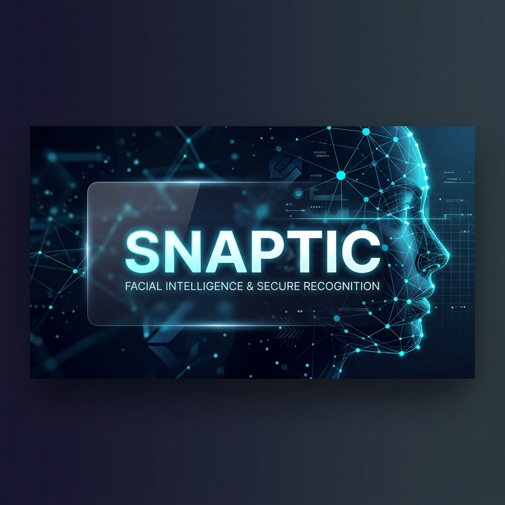
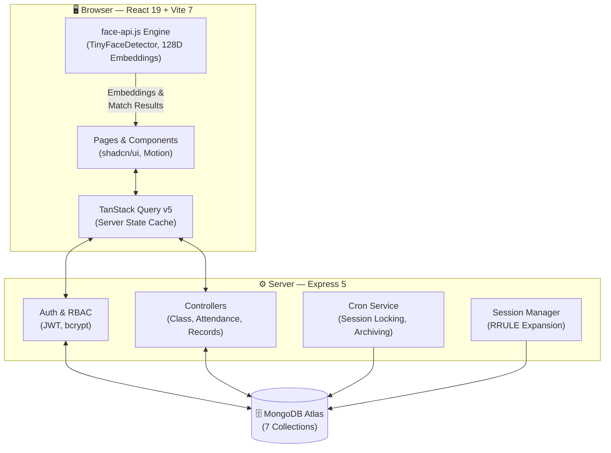

<div align="center">
  

  # ⚡ Snaptic
  ### AI-Powered Facial Attendance System for Modern Classrooms

  [](https://snaptic-one.vercel.app)
  [](LICENSE)
  [](https://react.dev)
  [](https://vitejs.dev)
  [](https://tailwindcss.com)
  [](https://expressjs.com)
  [](https://mongodb.com)

  **Snaptic** is a web-based attendance management platform that uses **in-browser facial recognition** to eliminate manual roll calls. A teacher simply points their webcam at the class — the AI identifies students in real time and marks them present, all without any dedicated hardware or server-side GPU processing.

  [Features](#-key-features) • [How It Works](#-how-it-works) • [Tech Stack](#-tech-stack) • [Getting Started](#-getting-started) • [Architecture](#-architecture) • [API](#-api-overview)
</div>

---

## 📖 Overview

Manual attendance in Indian classrooms wastes 5–10 minutes per period, is prone to errors, and is easily exploited through proxy attendance. Multiplied across an academic year, this adds up to **200+ hours of lost instructional time per teacher**.

Snaptic solves this by running **TensorFlow.js-powered facial recognition directly in the browser**. When a teacher initiates a session, the device camera scans the classroom, detects and matches student faces against stored 128-dimensional embeddings, and marks each recognized student present — the entire class recorded in **under two minutes**, with zero additional hardware.

The platform is designed as a **teacher-owned tool**, not an institutional ERP. Any teacher can sign up, create classes, set schedules, and manage attendance independently. Students self-register their face through a guided browser-based enrollment flow.

> **Academic Project** — Built as a B.Tech final-year project at the Institute of Engineering & Technology, Dr. Rammanohar Lohia Avadh University, Ayodhya, under the supervision of Er. Nidhi Prasad.

---

## 🚀 Key Features

| Feature | Description |
|---|---|
| 🎯 **Real-Time Multi-Face Recognition** | Identifies multiple students simultaneously using TinyFaceDetector + 128D face embeddings via `@vladmandic/face-api`, running entirely in the browser |
| 📋 **4-Step Attendance Wizard** | Class Selection → Facial Scan → Manual Fallback → Review & Submit — ensures no student is missed |
| 📅 **Smart Scheduling** | Create recurring class schedules with RFC 5545 recurrence rules (RRULE). Sessions are auto-generated for the full semester |
| 🔒 **Session Lifecycle & Auto-Locking** | Sessions progress through `scheduled → inprogress → submitted → finalized`. A cron job auto-locks expired sessions to prevent tampering |
| 👤 **Guided Face Enrollment** | Students register their face via webcam with built-in quality checks (confidence, size, centering) and auto-capture |
| 🛡️ **Role-Based Access Control** | Teacher and Student roles with distinct dashboards, enforced at both frontend and API levels. Invite system for onboarding teachers |
| 📊 **Analytics & Records** | Per-session and per-student attendance statistics with visual charts (Recharts). Session history and attendance ledgers |
| 🌗 **Dark/Light Theme** | System-aware theme with manual toggle, oklch color tokens, and premium UI built on shadcn/ui |

---

## 🔄 How It Works

```
┌─────────────────┐    ┌─────────────────┐    ┌─────────────────┐    ┌─────────────────┐
│  1. SELECT CLASS │───▶│  2. FACIAL SCAN  │───▶│  3. MANUAL MARK │───▶│  4. REVIEW &    │
│                 │    │                 │    │                 │    │     SUBMIT      │
│ Teacher picks a │    │ Camera activates │    │ AI-marked names │    │ Present/absent  │
│ class with an   │    │ and detects      │    │ shown pre-filled│    │ summary with    │
│ active session  │    │ faces in real    │    │ Teacher can     │    │ counts & % —    │
│ for today       │    │ time, matching   │    │ toggle any      │    │ save to lock    │
│                 │    │ against enrolled │    │ student manually│    │ the record      │
│                 │    │ student faces    │    │                 │    │                 │
└─────────────────┘    └─────────────────┘    └─────────────────┘    └─────────────────┘
```

---

## 🛠️ Tech Stack

### Frontend

| Category | Technologies |
|---|---|
| **Core** | [React 19](https://react.dev) · [Vite 7](https://vitejs.dev) · [React Router 7](https://reactrouter.com) |
| **Styling** | [Tailwind CSS v4](https://tailwindcss.com) · [shadcn/ui](https://ui.shadcn.com) (Radix Nova) · oklch tokens |
| **Face Recognition** | [@vladmandic/face-api](https://github.com/vladmandic/face-api) (TensorFlow.js) |
| **Server State** | [TanStack Query v5](https://tanstack.com/query) · [Axios](https://axios-http.com) |
| **Forms** | [React Hook Form](https://react-hook-form.com) · [Zod v4](https://zod.dev) |
| **Animation** | [Motion](https://motion.dev) (Framer Motion) · [GSAP](https://gsap.com) · [Lenis](https://lenis.darkroom.engineering) |
| **Charts** | [Recharts](https://recharts.org) |
| **Calendar** | [FullCalendar](https://fullcalendar.io) |
| **3D** | [Three.js](https://threejs.org) · [Spline](https://spline.design) |
| **Icons** | [Lucide](https://lucide.dev) · [Remix Icons](https://remixicon.com) · [Tabler Icons](https://tabler.io/icons) |

### Backend

| Category | Technologies |
|---|---|
| **Framework** | [Express 5](https://expressjs.com) · [Node.js](https://nodejs.org) |
| **Database** | [MongoDB](https://mongodb.com) · [Mongoose 9](https://mongoosejs.com) |
| **Auth** | [JWT](https://jwt.io) (HttpOnly cookies) · [bcrypt](https://github.com/kelektiv/node.bcrypt.js) |
| **Scheduling** | [node-cron](https://github.com/node-cron/node-cron) · [RRule](https://github.com/jakubroztocil/rrule) |
| **Validation** | [validator.js](https://github.com/validatorjs/validator.js) |
| **API Docs** | [Swagger UI](https://swagger.io) · OpenAPI 3.0 |
| **Deployment** | [Render](https://render.com) · [MongoDB Atlas](https://www.mongodb.com/atlas) |

---

## 🏗️ Architecture

Snaptic uses a **client-side heavy processing model** — facial recognition runs entirely in the browser, meaning no video data ever leaves the teacher's device. The server handles data persistence, authentication, and session lifecycle management.



---

## 🏁 Getting Started

### Prerequisites

- **Node.js** v20 or higher
- **MongoDB** — local instance or [MongoDB Atlas](https://www.mongodb.com/atlas) connection string
- **npm**

### 1. Clone the Repository

```bash
git clone https://github.com/Tushar-Sahu7/Snaptic.git
cd Snaptic
```

### 2. Backend Setup

```bash
cd backend
npm install
```

Create a `.env` file in the `backend` directory:

```env
PORT=5000
MONGO_URI=your_mongodb_connection_string
JWT_SECRET=your_jwt_secret_key
CLIENT_URL=http://localhost:5173
NODE_ENV=development
```

Start the development server:

```bash
npm run dev
```

### 3. Frontend Setup

```bash
cd ../frontend
npm install
```

Create a `.env` file in the `frontend` directory:

```env
VITE_API_URL=http://localhost:5000
```

Start the development server:

```bash
npm run dev
```

The app will be running at `http://localhost:5173` with the API at `http://localhost:5000`.

---

## 📁 Project Structure

```
Snaptic/
├── assets/                      # Branding assets (banner, etc.)
├── backend/                     # Express 5 REST API
│   ├── src/
│   │   ├── server.js            # Entry point
│   │   ├── config/              # DB connection, Swagger, seed
│   │   ├── controllers/         # auth, class, attendance, record
│   │   ├── models/              # 7 Mongoose schemas
│   │   │   ├── User.js          # Base account (email, password, role)
│   │   │   ├── TeacherProfile.js
│   │   │   ├── StudentProfile.js # Face embedding (128D)
│   │   │   ├── Class.js         # Schedule, RRULE, soft delete
│   │   │   ├── Enrollment.js    # Student-class junction
│   │   │   ├── AttendanceSession.js
│   │   │   └── AttendanceRecord.js
│   │   ├── routes/              # API route definitions + Swagger
│   │   ├── services/            # Cron jobs, RRULE session manager
│   │   ├── middlewares/         # JWT auth, role authorization
│   │   └── utils/               # Date/timezone helpers (IST)
│   └── openapi.json             # Static OpenAPI 3.0 spec
│
├── frontend/                    # React 19 + Vite 7 SPA
│   ├── src/
│   │   ├── pages/               # Route-level pages
│   │   │   ├── auth/            # Login, Register
│   │   │   ├── shared/          # Dashboard, Classes, Profile, Face Enrollment
│   │   │   └── teacher/         # Attendance session pages
│   │   ├── features/            # Feature modules
│   │   │   ├── attendance/      # 4-step wizard, face scan, marking
│   │   │   ├── auth/            # Login/register forms, face enrollment
│   │   │   ├── classes/         # Class CRUD, student management
│   │   │   └── records/         # Attendance records & analytics
│   │   ├── components/          # Shared & UI components
│   │   │   ├── shared/          # ClassCard, SessionCard, StatusBadge...
│   │   │   └── ui/              # 45+ shadcn/ui primitives
│   │   ├── context/             # AuthContext (TanStack Query)
│   │   ├── hooks/               # Debounce, mobile detection, live clock
│   │   └── lib/                 # Axios instance, utils, date helpers
│   └── public/
│       └── models/              # TensorFlow.js face-api model weights
│
└── vercel.json                  # Deployment configuration
```

---

## 🔌 API Overview

The backend exposes a RESTful API at `/api`. Full interactive documentation is available at `/api-docs` (Swagger UI).

| Group | Base Path | Endpoints | Key Operations |
|---|---|---|---|
| **Auth** | `/api/auth` | 10 | Register, Login, Logout, Profile, Password change, Face enroll/status/delete, Teacher invite |
| **Classes** | `/api/classes` | 12 | CRUD, Bulk operations, Student add/remove/import, Search |
| **Attendance** | `/api/attendance` | 7 | Today's sessions, Start session, Mark (face/manual), Submit, Reset |
| **Records** | `/api/records` | 5 | Class summary, Session history, Per-student records |

> See [backend/README.md](backend/README.md) for complete endpoint documentation with request/response details.

---

## 🔐 Security & Privacy

| Aspect | Implementation |
|---|---|
| **Face Data** | Faces are converted to 128-dimensional mathematical vectors (descriptors). Only the descriptor is used for matching — not the image itself |
| **Client-Side Processing** | All face detection and recognition runs locally in the browser. No video or image data is sent to any server for AI processing |
| **Authentication** | JWT tokens stored in `HttpOnly`, `Secure`, `SameSite` cookies — immune to XSS-based token theft |
| **Password Storage** | Hashed with bcrypt (10 rounds) |
| **Role Enforcement** | RBAC enforced server-side via middleware on every API endpoint — not just on the frontend |
| **Record Integrity** | Attendance records auto-lock after the session window + 5-minute grace period. Locked records cannot be modified |
| **Soft Deletes** | Classes are soft-deleted (timestamped) for audit trails |

---

## 🌐 Deployment

| Component | Platform | Details |
|---|---|---|
| **Frontend** | [Vercel](https://vercel.com) | Auto-deploy from `main` branch. SPA rewrite via `vercel.json`. Production URL: [snaptic-one.vercel.app](https://snaptic-one.vercel.app) |
| **Backend** | [Render](https://render.com) | Auto-deploy from GitHub. Environment variables via Render secrets |
| **Database** | [MongoDB Atlas](https://www.mongodb.com/atlas) | Free tier (512MB). Connection pooling via Mongoose |

---

## 🔮 Future Scope

- **📱 Progressive Web App (PWA)** — Offline attendance marking with auto-sync on reconnect
- **📆 Google Calendar Integration** — Auto-sync class schedules with reminder notifications
- **📈 Advanced Analytics** — Semester trends, AI-driven risk identification for low-attendance students, exportable PDF/Excel reports
- **👥 Multi-Teacher Classes** — Co-teaching support with shared rosters and attendance records
- **🏫 Institutional Mode** — Administrative tier for department-level aggregated analytics

---

## 👥 Team

Built by students of the Department of Computer Science & Engineering, IET RMLAU, Ayodhya:

| Name | Roll No. |
|---|---|
| **Tushar Sahu** | 22154 |
| **Tanishq Sonkar** | 22153 |
| **Prem Kumar** | 22130 |
| **Gaurav Singh** | 22119 |

**Supervisor:** Er. Nidhi Prasad, Assistant Professor, Dept. of CSE

---

## 📄 License

This project is licensed under the MIT License — see the [LICENSE](LICENSE) file for details.

---

<div align="center">
  Built with ❤️ at IET RMLAU, Ayodhya
</div>
