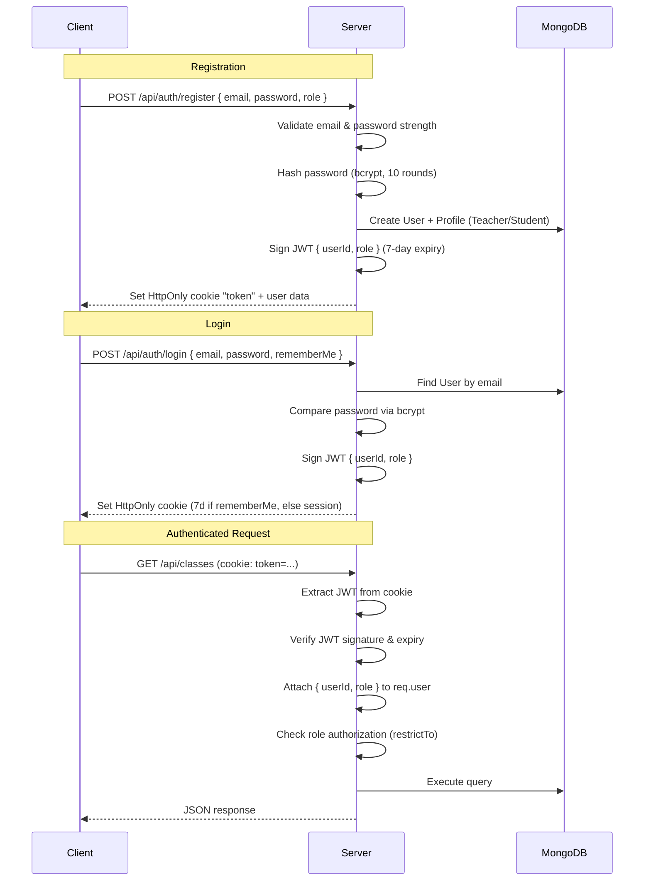
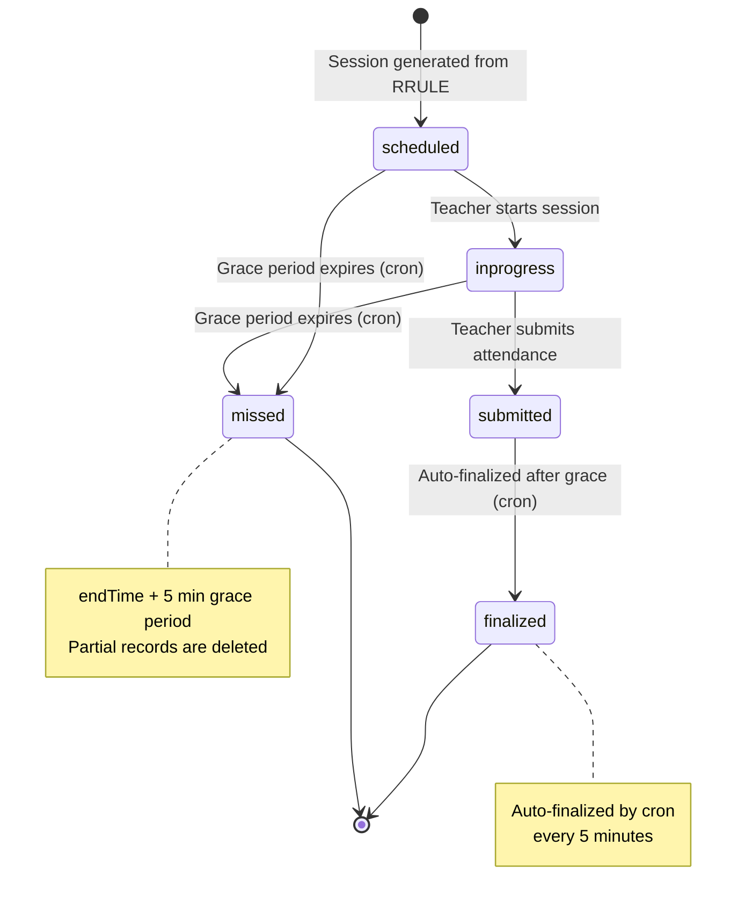

# 🎯 Snaptic — Backend API

> **Intelligent Attendance Management System**
> RESTful API powering face-recognition attendance, RRULE-based scheduling, and real-time session management.

[](https://expressjs.com/)
[](https://mongoosejs.com/)
[](https://nodejs.org/)
[](../LICENSE)

---

## 📑 Table of Contents

- [Overview](#-overview)
- [Tech Stack](#-tech-stack)
- [Project Structure](#-project-structure)
- [Getting Started](#-getting-started)
- [Environment Variables](#-environment-variables)
- [Database Schema](#-database-schema)
- [API Reference](#-api-reference)
- [Authentication Flow](#-authentication-flow)
- [Session Lifecycle](#-session-lifecycle)
- [Cron Jobs](#-cron-jobs)
- [Key Design Decisions](#-key-design-decisions)

---

## 🔭 Overview

The Snaptic backend is a Node.js + Express 5 REST API that provides:

- **Role-based authentication** (Teacher / Student) with JWT + HttpOnly cookies
- **Class management** with RFC 5545 RRULE scheduling
- **Attendance sessions** with a robust state-machine lifecycle
- **Face recognition support** via 128-dimensional embedding storage
- **Automated cron jobs** for session finalization and class archiving
- **Swagger / OpenAPI** documentation served at `/api-docs`

---

## 🛠 Tech Stack

| Category | Technology | Purpose |
|----------|------------|---------|
| **Runtime** | Node.js 20+ | JavaScript runtime |
| **Framework** | Express 5 | HTTP server & routing |
| **Database** | MongoDB Atlas + Mongoose 9 | Document storage & ODM |
| **Auth** | jsonwebtoken + bcrypt | JWT tokens & password hashing |
| **Scheduling** | rrule + node-cron | Recurrence rules & periodic tasks |
| **Dates** | date-fns-tz | Timezone-aware formatting (IST) |
| **Validation** | validator | Email & password validation |
| **Docs** | swagger-jsdoc + swagger-ui-express | OpenAPI spec & interactive UI |
| **Config** | dotenv | Environment variable loading |
| **HTTP** | cors + cookie-parser | CORS policy & cookie handling |

---

## 📂 Project Structure

```
backend/
├── package.json
├── .env                              # Environment variables (not committed)
└── src/
    ├── server.js                     # Entry point — DB, CORS, routes, Swagger
    ├── config/
    │   ├── db.js                     # MongoDB connection via Mongoose
    │   ├── seed.js                   # Demo teacher seeding script
    │   └── swagger.js                # Swagger/OpenAPI configuration
    ├── controllers/
    │   ├── auth.controller.js        # Registration, login, profile, face enrollment
    │   ├── class.controller.js       # Class CRUD, roster, bulk operations
    │   ├── attendance.controller.js  # Session start, marking, submission
    │   └── record.controller.js      # Attendance records & analytics
    ├── middlewares/
    │   └── auth.middleware.js         # JWT verification + role authorization
    ├── models/
    │   ├── User.js                   # Base user account
    │   ├── TeacherProfile.js         # Teacher-specific profile data
    │   ├── StudentProfile.js         # Student profile + face embedding
    │   ├── Class.js                  # Class configuration & RRULE schedule
    │   ├── Enrollment.js             # Student ↔ Class junction table
    │   ├── AttendanceSession.js      # Session lifecycle state machine
    │   └── AttendanceRecord.js       # Individual attendance entries
    ├── routes/
    │   ├── auth.routes.js            # /api/auth/*
    │   ├── class.routes.js           # /api/classes/*
    │   ├── attendance.routes.js      # /api/attendance/*
    │   └── record.routes.js          # /api/records/*
    ├── services/
    │   ├── cronService.js            # Finalization & archiving cron jobs
    │   └── sessionManager.js         # RRULE session generation & sync
    └── utils/
        └── dateUtils.js              # IST timezone helper functions
```

---

## 🚀 Getting Started

### Prerequisites

- **Node.js** ≥ 20
- **MongoDB** Atlas cluster (or local MongoDB instance)
- **npm** ≥ 9

### Installation

```bash
# 1. Clone the repository
git clone https://github.com/Tushar-Sahu7/Snaptic.git
cd Snaptic/backend

# 2. Install dependencies
npm install

# 3. Create environment file
cp .env.example .env
# Edit .env with your values (see Environment Variables section)

# 4. Start the development server
npm run dev
```

### Available Scripts

| Script | Command | Description |
|--------|---------|-------------|
| `dev` | `node --watch src/server.js` | Start with auto-restart on file changes |
| `start` | `node src/server.js` | Production start |

> The server starts on `http://localhost:5000` by default. Swagger UI is available at `http://localhost:5000/api-docs`.

---

## 🔐 Environment Variables

Create a `.env` file in the `backend/` directory:

```env
# Server
PORT=5000
NODE_ENV=development          # 'production' or 'development'

# Database
MONGO_URI=mongodb+srv://<user>:<password>@<cluster>.mongodb.net/<dbname>

# Authentication
JWT_SECRET=your-super-secret-jwt-key

# Frontend
CLIENT_URL=http://localhost:5173    # CORS allowed origin
```

| Variable | Required | Default | Description |
|----------|----------|---------|-------------|
| `PORT` | No | `5000` | Server listen port |
| `NODE_ENV` | No | `development` | Affects cookie security settings |
| `MONGO_URI` | **Yes** | — | MongoDB connection string |
| `JWT_SECRET` | **Yes** | — | Secret key for signing JWT tokens |
| `CLIENT_URL` | No | `http://localhost:5173` | Frontend URL for CORS |

---

## 🗄 Database Schema

The application uses **7 Mongoose models** with a separated profile pattern for flexible role-based data.

```mermaid
erDiagram
    User ||--o| TeacherProfile : "has"
    User ||--o| StudentProfile : "has"
    User ||--o{ Enrollment : "enrolls"
    User ||--o{ Class : "teaches"
    Class ||--o{ Enrollment : "contains"
    Class ||--o{ AttendanceSession : "schedules"
    AttendanceSession ||--o{ AttendanceRecord : "tracks"
    User ||--o{ AttendanceRecord : "recorded for"

    User {
        ObjectId _id PK
        String email "unique, lowercase"
        String password "bcrypt hashed"
        String role "teacher | student"
        Boolean isFirstLogin "default: true"
    }

    TeacherProfile {
        ObjectId _id PK
        ObjectId userId FK "→ User (unique)"
        String name
        String avatar
        Boolean faceEnrolled
        String invite_token
        Date invite_expiry
    }

    StudentProfile {
        ObjectId _id PK
        ObjectId userId FK "→ User (unique)"
        String name
        String avatar
        Array embedding "128D float vector"
        Boolean faceEnrolled
    }

    Class {
        ObjectId _id PK
        String name
        String description
        String icon "default: BookOpen"
        String color "OKLCH format"
        String status "active | archived"
        String schedule_rrule "RFC 5545"
        Number schedule_duration "minutes"
        String location
        ObjectId teacherId FK "→ User"
        Number studentCount
        Date deletedAt "soft delete"
    }

    Enrollment {
        ObjectId _id PK
        ObjectId studentId FK "→ User"
        ObjectId classId FK "→ Class"
        ObjectId teacherId FK "→ User"
        String status "active | inactive"
    }

    AttendanceSession {
        ObjectId _id PK
        ObjectId classId FK "→ Class"
        ObjectId teacherId FK "→ User"
        Date date
        String location
        Date startTime
        Date endTime
        String status "scheduled | inprogress | submitted | finalized | missed"
    }

    AttendanceRecord {
        ObjectId _id PK
        ObjectId sessionId FK "→ AttendanceSession"
        ObjectId studentId FK "→ User"
        ObjectId classId FK "→ Class"
        ObjectId teacherId FK "→ User"
        String status "present | absent"
        String method "face | manual"
        Date markedAt
    }
```

### Index Strategy

| Model | Index | Type |
|-------|-------|------|
| `User` | `{ email: 1 }` | Unique |
| `TeacherProfile` | `{ userId: 1 }` | Unique |
| `StudentProfile` | `{ userId: 1 }` | Unique |
| `Class` | `{ teacherId: 1, status: 1 }` | Compound |
| `Enrollment` | `{ studentId: 1, classId: 1 }` | Unique Compound |
| `Enrollment` | `{ classId: 1, status: 1 }` | Compound |
| `AttendanceSession` | `{ classId: 1, startTime: 1 }` | Unique Compound |
| `AttendanceRecord` | `{ sessionId: 1, studentId: 1 }` | Unique Compound |

---

## 📡 API Reference

> **Base URL:** `http://localhost:5000`
> **Interactive Docs:** `http://localhost:5000/api-docs` (Swagger UI)

### 🔑 Auth — `/api/auth`

| Method | Endpoint | Auth | Description |
|--------|----------|------|-------------|
| `POST` | `/api/auth/register` | ✗ | Register a new user (teacher or student) |
| `POST` | `/api/auth/login` | ✗ | Login — returns JWT in HttpOnly cookie |
| `GET` | `/api/auth/me` | ✓ | Get current user profile with role-based stats |
| `PUT` | `/api/auth/profile` | ✓ | Update name or avatar |
| `POST` | `/api/auth/change-password` | ✓ | Change password (requires current password) |
| `POST` | `/api/auth/logout` | ✗ | Logout — clears auth cookie |
| `POST` | `/api/auth/invite` | 🔒 Teacher | Generate invite token (1-hour expiry) |
| `POST` | `/api/auth/face/enroll` | ✓ | Save face photo + 128D embedding vector |
| `GET` | `/api/auth/face/status` | ✓ | Check face enrollment status |
| `DELETE` | `/api/auth/face` | ✓ | Delete face enrollment data |

### 📚 Classes — `/api/classes`

| Method | Endpoint | Auth | Description |
|--------|----------|------|-------------|
| `GET` | `/api/classes` | ✓ | List user's classes (role-aware) |
| `POST` | `/api/classes` | 🔒 Teacher | Create class with RRULE schedule |
| `GET` | `/api/classes/students/search` | ✓ | Search students by name or email |
| `PUT` | `/api/classes/bulk/status` | 🔒 Teacher | Bulk update class statuses |
| `DELETE` | `/api/classes/bulk` | 🔒 Teacher | Bulk soft-delete classes |
| `GET` | `/api/classes/:id` | ✓ | Get class details with enrolled students |
| `PUT` | `/api/classes/:id` | 🔒 Teacher | Update class settings |
| `DELETE` | `/api/classes/:id` | 🔒 Teacher | Soft-delete a class |
| `POST` | `/api/classes/:id/students` | 🔒 Teacher | Add student to class roster |
| `POST` | `/api/classes/:id/enrollments/import` | 🔒 Teacher | Import students from another class |
| `DELETE` | `/api/classes/:id/students/bulk` | 🔒 Teacher | Bulk remove students |
| `DELETE` | `/api/classes/:id/students/:studentId` | 🔒 Teacher | Remove a single student |

### ✅ Attendance — `/api/attendance`

| Method | Endpoint | Auth | Description |
|--------|----------|------|-------------|
| `GET` | `/api/attendance/today` | ✓ | Get all of today's sessions |
| `GET` | `/api/attendance/today/:classId` | ✓ | Get today's session for a specific class |
| `POST` | `/api/attendance/start/:classId` | 🔒 Teacher | Start session, initialize records |
| `PUT` | `/api/attendance/mark` | 🔒 Teacher | Mark student (face or manual) |
| `POST` | `/api/attendance/submit/:sessionId` | 🔒 Teacher | Submit / finalize session |
| `DELETE` | `/api/attendance/session/:sessionId/reset` | 🔒 Teacher | Reset session back to scheduled |
| `GET` | `/api/attendance/session/:sessionId/records` | 🔒 Teacher | Get all records for a session |

### 📊 Records — `/api/records`

| Method | Endpoint | Auth | Description |
|--------|----------|------|-------------|
| `GET` | `/api/records/class/:classId` | 🔒 Teacher | Class-wide attendance summary |
| `GET` | `/api/records/class/:classId/sessions` | 🔒 Teacher | All sessions for a class |
| `GET` | `/api/records/class/:classId/student` | ✓ | Student's record for a class |
| `GET` | `/api/records/student/history` | 🔒 Student | Full student attendance history |
| `GET` | `/api/records/session/:sessionId` | ✓ | Detailed session breakdown |

### 🔧 Standalone Endpoints

| Method | Endpoint | Auth | Description |
|--------|----------|------|-------------|
| `GET` | `/api` | ✗ | Health check |
| `GET` | `/api/students/search` | 🔒 Teacher | Search students globally |
| `GET` | `/api-docs` | ✗ | Swagger UI (interactive API docs) |

> **Legend:** ✗ = Public · ✓ = Any authenticated user · 🔒 = Specific role required

---

## 🔒 Authentication Flow



### Cookie Configuration

| Setting | Development | Production |
|---------|-------------|------------|
| `httpOnly` | `true` | `true` |
| `sameSite` | `lax` | `none` |
| `secure` | `false` | `true` |
| `maxAge` | 7 days (if `rememberMe`) | 7 days (if `rememberMe`) |

### Invite System

Teachers can generate **UUID invite tokens** (1-hour expiry) to allow new teacher registrations. The token is stored on the inviting teacher's profile and validated during registration.

---

## 🔄 Session Lifecycle

Attendance sessions follow a strict **state-machine** pattern with automated transitions via cron jobs.



### State Descriptions

| State | Description |
|-------|-------------|
| `scheduled` | Session generated from RRULE, waiting for start time |
| `inprogress` | Teacher has started the session, attendance is being marked |
| `submitted` | Teacher has submitted attendance, awaiting finalization |
| `finalized` | Session is locked — no further changes allowed |
| `missed` | Session window passed without completion (5-min grace) |

---

## ⏰ Cron Jobs

Two automated background jobs manage session lifecycle and class archiving.

| Job | Schedule | Description |
|-----|----------|-------------|
| **Session Finalization** | `*/5 * * * *` (every 5 min) | Transitions `submitted → finalized` after grace period. Transitions `scheduled/inprogress → missed` after grace period. Deletes partial records for missed sessions. |
| **Class Archiving** | `0 0 * * *` (daily at midnight) | Transitions `active → archived` for classes past their end date. |

---

## 🏗 Key Design Decisions

| Decision | Rationale |
|----------|-----------|
| **Soft deletes** for classes | Preserves historical attendance data; `deletedAt` field instead of removal |
| **Separated User / Profile models** | Flexible role-based data; base `User` handles auth, profiles hold role-specific fields |
| **RRULE-based scheduling** | RFC 5545 standard enables complex recurrence (e.g., "every Mon/Wed/Fri") without custom logic |
| **Pre-generated sessions** | Sessions are materialized from RRULE upfront via `sessionManager`, enabling status tracking |
| **128D face embeddings** on `StudentProfile` | Stored directly in MongoDB for fast lookup during face-recognition attendance |
| **MongoDB transactions** | Used for critical multi-document operations (class creation, session start) |
| **Timezone hardcoded to IST** | `Asia/Kolkata` — designed for Indian educational institutions |
| **HttpOnly cookies** for JWT | Prevents XSS-based token theft vs. localStorage approach |
| **5-minute grace period** | Buffer for late submissions before sessions are auto-marked as missed |
| **OKLCH color format** | Modern perceptually uniform color space for class theming |

---

## 📄 License

This project is part of the [Snaptic](https://github.com/Tushar-Sahu7/Snaptic) monorepo. See the root [LICENSE](../LICENSE) for details.

---

<div align="center">
  <sub>Built with ❤️ for smarter classrooms</sub>
</div>
